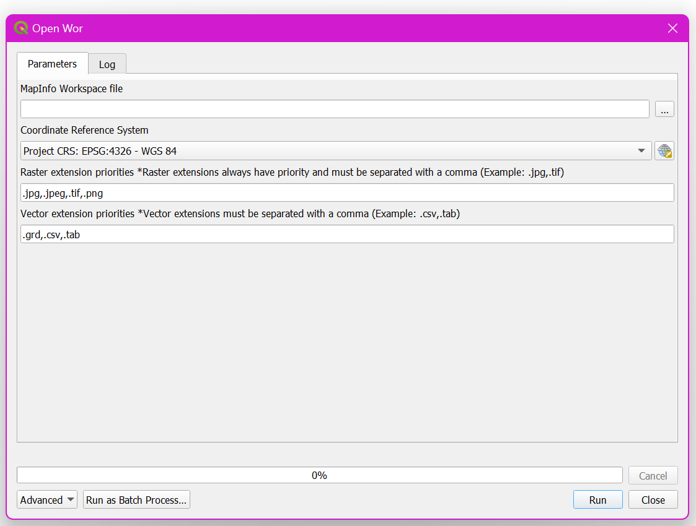
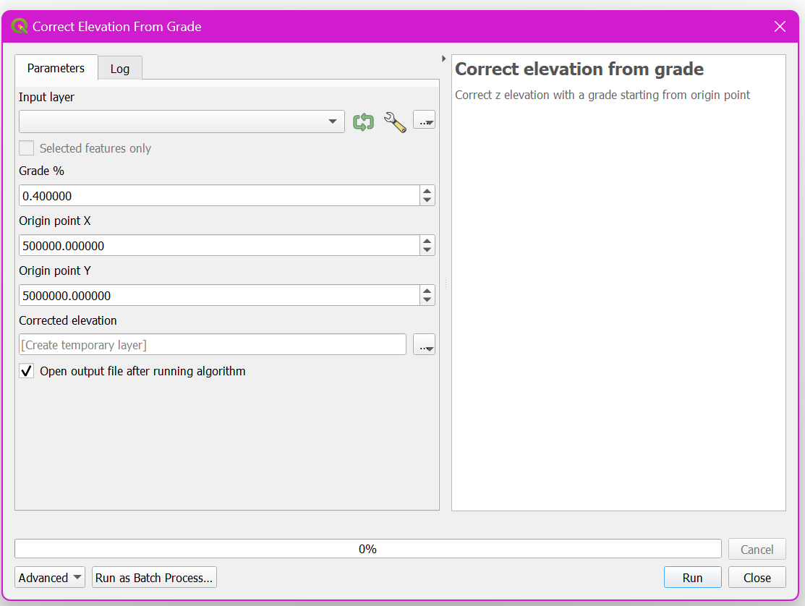

# Devactif processing toolbox algorithms

## OpenWor
Open each layer listed in a .wor file. 

## Correct elevation
Correct z elevation with a grade starting from origin point

## development commands
make clean zip:  
  `pb_tool zip`